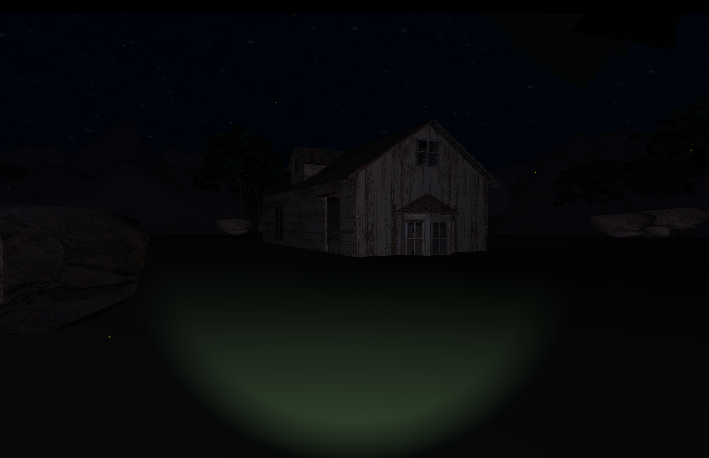
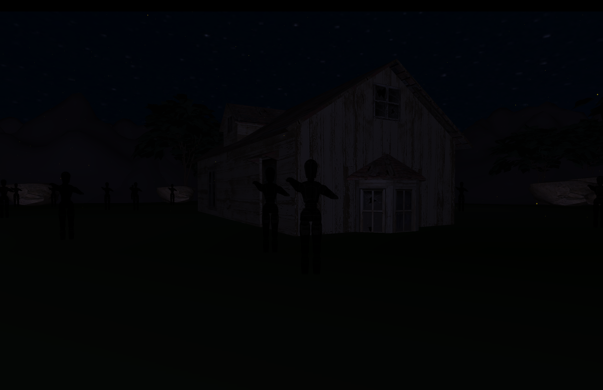
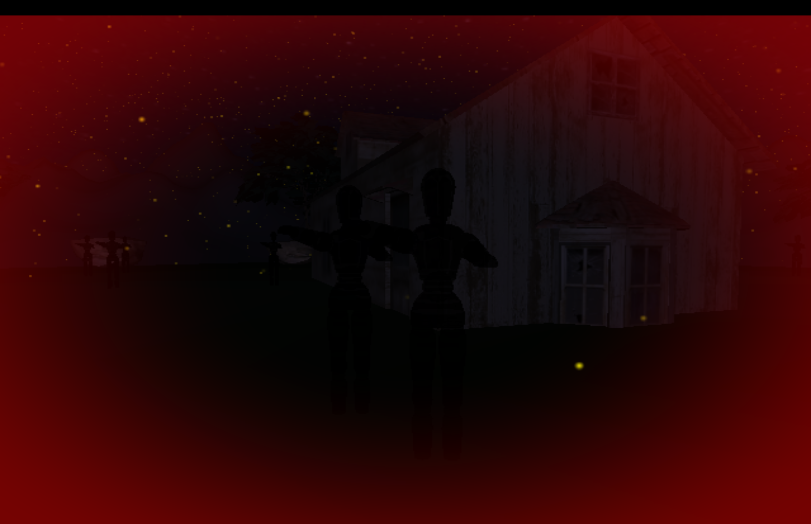
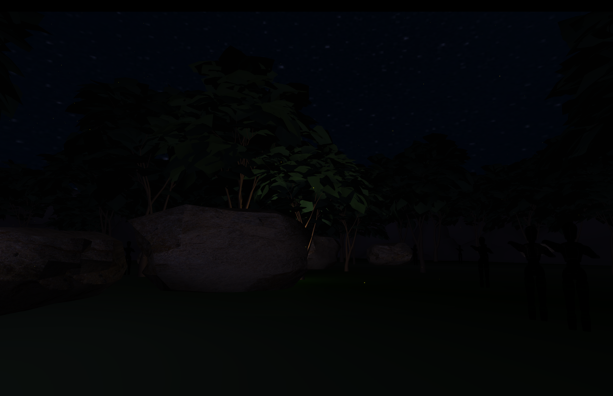
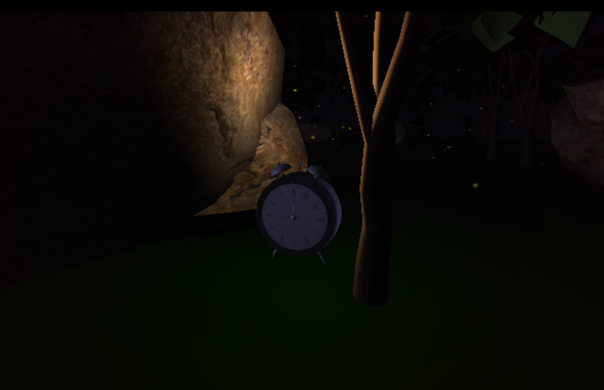
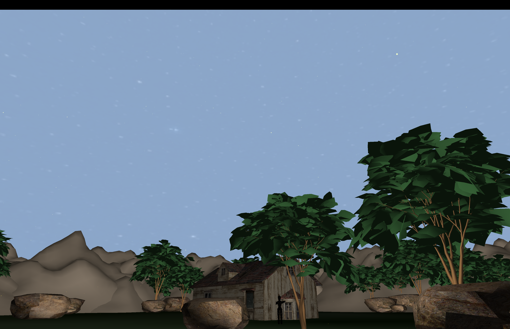

# CSC 471 Final Project Webpage

## Brandon Howell

Here is the webpage for my final project in computer graphics. This project is a spooky game where you explore a nighttime valley with trees, rocks and a cottage. You have a flashlight to help make your way through the dark environment; however, when you turn your light off, you may see shadows of things that aren't there with the light on. But there are also helpful objects that are only visible in the dark. Can you find the hidden clock to fast forward time to morning and escape the valley? (Hint: find the light within the darkness!)

### Features

- First-person exploration of a complex 3D environment
- Dynamic lighting with a toggleable flashlight
- Firefly particle system
- Custom nighttime skybox
- Red warning vignette when the player gets close to hidden figures
- Day and night cycle
- Hidden objects and secrets to discover
- Hierarchically modeled and animated characters (hidden shadow figures)
- Collision detection with clock to escape the nighttime

### Screenshots

Spoilers below, not that there is much of a story, but you may want to try the game first before looking at these :)

*The player starts in a dark valley with a flashlight. They face a cottage surrounded by many fireflies.*

*With the flashlight off, creepy figures that were previously hidden become visible in the dark.*

*Getting too close to the shadowy figures triggers a red vignette warning effect.*

*With your flashlight off, you can see a glowing object in the distance that wasn't visible before.*

*The player finds the hidden clock that will fast forward time to morning.*

*After finding the clock, the environment transitions to a bright morning scene, and the haunting figures are gone (except for one by the cottage, for those who are curious about the shadowy figures and want to analyze them in better light).*

### Future considerations

I'm happy with how the project turned out overall, but if I had more time there are several features I would love to add:

- More complex animations for the shadowy figures
  - I would love for the figures to slowly move towards the player when they are in the dark, increasing tension
  - Maybe even a weeping angels type mechanic where they only move when the player isn't looking at them
- A battery mechanic for the flashlight to increase challenge
- More hidden objects and secrets to discover in the environment
- Sound effects and background music to enhance the atmosphere
- A "death" mechanic where you have to restart if you get caught by the shadow figures
- A way to restart without restarting the whole program
